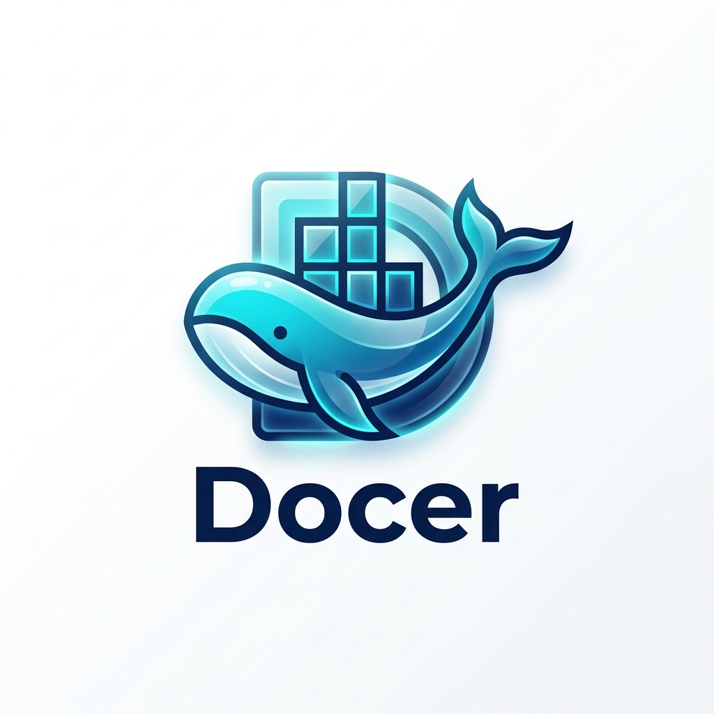

<p align="center">
  
</p>

<h1 align="center">🐳 Docer: Ultimate Docker Guide</h1>

<p align="center">
  
  
  
</p>

<p align="center">
  <i>Полноценное руководство по работе с Docker: от базовых команд до развертывания Django приложений.</i>
</p>

---

## 📋 Содержание
1. [🔹 Основы Docker](#-основы-docker)
2. [🏗️ Создание Образов (Dockerfile)](#-создание-образов-dockerfile)
3. [🚀 Django + Docker Compose Setup](#-django--docker-compose-setup)
4. [🛠️ Полезные команды](#-полезные-команды)

---

## 🔹 Основы Docker

### Работа с контейнерами 📦

| Команда | Описание |
| :--- | :--- |
| `docker ps` | Вывод запущенных контейнеров |
| `docker ps -a` | Вывод всех контейнеров (включая остановленные) |
| `docker run <image>` | Скачивание и запуск образа |
| `docker run --name <name> <image>` | Запуск с присвоением имени |
| `docker start <name/id>` | Запуск существующего контейнера |
| `docker stop <name/id>` | Плавная остановка |
| `docker kill <name/id>` | Принудительная остановка |
| `docker rm <name/id>` | Удаление контейнера |

> [!TIP]
> Используйте флаг `-it` для интерактивного режима: `docker run -it python:3.12-alpine`

---

## 🏗️ Создание Образов (Dockerfile)

### 1️⃣ Базовый Dockerfile
Для подключения Docker к проекту создайте файл `Dockerfile` в корне проекта.

```dockerfile
# 1. Выбор образа
FROM python:3.12-alpine

# 2. Рабочая директория
WORKDIR /python-app

# 3. Копирование файлов
COPY . .

# 4. Команда запуска
CMD ["python", "main.py"]
```

### 2️⃣ Сборка и запуск
```bash
# Сборка образа
docker build . -t myapp:0.1

# Запуск контейнера
docker run --name my-app-container -it myapp:0.1
```

### 3️⃣ Оптимизация (Pip & Requirements)
Чтобы ускорить сборку, копируйте `requirements.txt` отдельно:

```dockerfile
FROM python:3.12-alpine

# Отключение буферизации для логов
ENV PYTHONUNBUFFERED=1

WORKDIR /python-app

# Копируем только зависимости
COPY requirements.txt .
RUN pip install --upgrade pip && \
    pip install --no-cache-dir -r requirements.txt

# Копируем остальной код
COPY . .

ENTRYPOINT ["python", "main.py"]
```

---

## 🚀 Django + Docker Compose Setup

### Этап 1: Подготовка 🛠️
Убедитесь, что у вас установлены:
- **Docker Desktop**
- **WSL2** (для Windows)

### Этап 2: Структура проекта 📂
```text
project/
├── backend/
│   ├── manage.py
│   ├── requirements.txt
│   ├── Dockerfile
│   ├── docker-compose.yml
│   └── .dockerignore
└── frontend/
```

### Этап 3: Настройка Docker Compose ⚙️
Создайте `docker-compose.yml` для автоматизации запуска:

```yaml
services:
  backend:
    build: .
    container_name: django_backend
    ports:
      - "8000:8000"
    volumes:
      - .:/app
    command: python manage.py runserver 0.0.0.0:8000
```

### Этап 4: Запуск 🎬
```bash
# Сборка и запуск в фоне
docker compose up -d --build

# Просмотр логов
docker logs -f django_backend

# Остановка
docker compose down
```

---

## 🛠️ Полезные команды

### Вход в контейнер
```bash
docker exec -it django_backend bash
```

### Работа с БД в контейнере
```bash
python manage.py migrate
python manage.py createsuperuser
```

### Очистка системы 🧹
```bash
# Удалить неиспользуемые данные
docker system prune -a

# Удалить все образы
docker rmi $(docker images -q)
```

---

<p align="center">
  Made with ❤️ for developers
</p>
